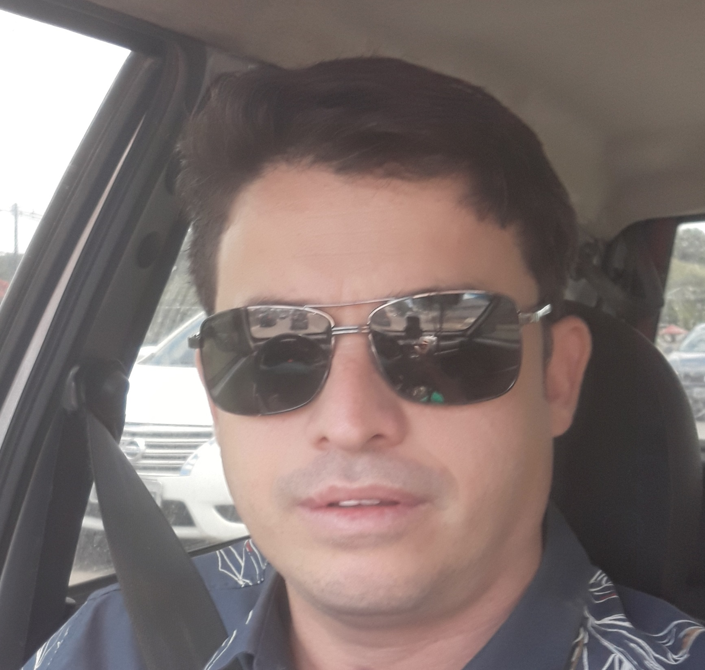

# RESUMO

## Português

Mestre em Ciências Geodésicas e Tecnologias da Geoinformação pela Universidade Federal de Pernambuco \(2011\) UFPE. Possui graduação em Engenharia Cartográfica pela Universidade Federal de Pernambuco \(2007\) UFPE. Formação de Nível Médio Técnico em Edificações pelo CEFET-PE \(IFPE\), Especialização em Auditoria, Avaliação e Perícias da Engenharia \(2014\) pelo IPOG. Doutorado em Andamento em Engenharia Civil pela Universidade Federal de Pernambuco, na área de concentração: Transportes e Gestão das Infra-estruturas Urbanas. Atualmente exercer o cargo de Professor Assistente no Departamento de Engenharia Cartográfica \(Decart\) da Universidade Federal de Pernambuco - UFPE; Foi Inspetor Coordenador do Conselho Regional de Engenharia e Agronomia de Pernambuco na Inspetoria de Carpina-PE \(2009-2017\). Já foi professor substituto no Departamento de Engenharia Cartográfica da Universidade Federal de Pernambuco - UFPE. Já foi Técnico em Reforma e Desenvolvimento Agrário pelo Instituto Nacional de Colonização e Reforma Agrária INCRA na Superintendência do estado de Pernambuco SR 03\(PE\). Atuou como Vice Presidente do Comitê de Certificação de Imóveis Rurais da Superintendência Regional de Pernambuco SR03 \(PE\). Foi Membro da Equipe de Testes e Homologação do Sistema de Gestão Fundiária - SIGEF. Membro do GT Sistema de Certificação Automatizada de Imóveis Rurais. Professor Substituto do Departamento de Engenharia Cartográfica da UFPE.

## Inglês

Master in Geodetic Sciences and Technologies of Geoinformation by the Federal University of Pernambuco \(2011\) UFPE. I have a degree in Cartographic Engineering from the Federal University of Pernambuco \(2007\) UFPE. Technical Level Training at CEFET-PE \(IFPE\), Specialization in Engineering Auditing, Assessment and Skills \(2014\) by IPOG. PhD in Civil Engineering by the Federal University of Pernambuco, in the area of ​​concentration: Transportation and Urban Infrastructure Management. Currently, he is Assistant Professor in the Department of Cartographic Engineering \(Decart\) of the Federal University of Pernambuco - UFPE; Inspector Coordinator of the Regional Council of Engineering and Agronomy of Pernambuco in the Carpina-PE Province. Already a substitute professor in the Department of Cartographic Engineering of the Federal University of Pernambuco - UFPE. Formerly a Technical in Agrarian Reform and Development by the National Institute of Colonization and Agrarian Reform INCRA in the Superintendence of the state of Pernambuco SR 03 \(PE\). He served as Vice President of the Rural Property Certification Committee of the Regional Superintendence of Pernambuco SR03 \(PE\). He was a Member of the Testing Team and Homologation of the Land Management System - SIGEF. Member of the WG System for Automated Certification of Rural Property. Substitute Professor of the Cartographic Engineering Department of UFPE.

