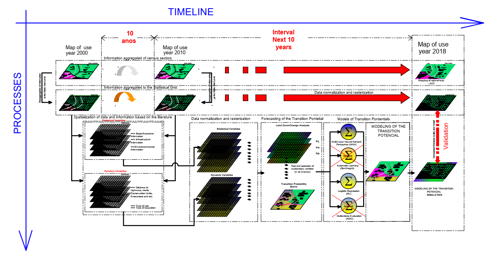
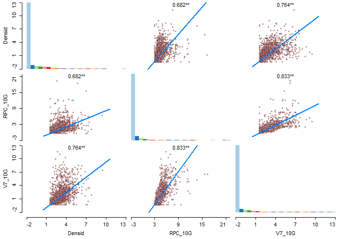
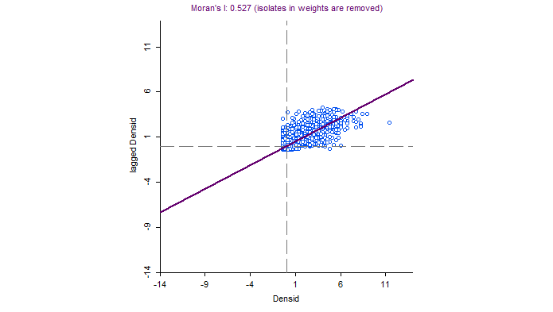
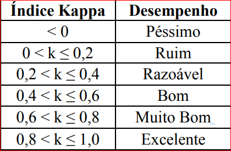

# Untitled

**TIME-SPACE MODELING OF IRREGULAR OCCUPATIONS AROUND BRAZILIAN HIGHWAYS, BASED ON STATIC GRIDS: CASE STUDY BR-408**

**1.** **Introduction**

 Brazil is a country with a predominantly road transport matrix. It’s road network is of 1,720,756 km, of which 211,468 km are paved \(CNT, 2020\). Despite recent government efforts, a significant part of the installed infrastructure lacks adequate maintenance and management, among which are the right-of-ways. These lanes represent a safety space, reserved so that the passersby around do not interact with the highway, as well as so that the highway does not interfere with the activities of residents or bordering users \(OLIVEIRA, 2018\)

 The construction of highways directly causes changes in the landscape, but in addition to physical changes, there are socioeconomic and environmental impacts in the region where this construction takes place \(BERTUSSI & ELLERY JUNIOR, 2012\). As it is an infrastructure that facilitates transportation, it provides expansion of the agricultural frontier, as well as functioning as an indicator of anthropic pressure on its margins and proximity \(PRADO et al., 2012\).

 The right to free movement within the national territory of citizens and their property is constitutionally guaranteed \(BRAZIL, 1988\), in compliance with the requirements of the traffic legislation \(CTB, 2000\), which establishes that traffic safety conditions as a principle must be guaranteed by an agency and that the use of right-of-ways, which corresponds to the lateral areas of rural highways, must be controlled. It is up to the Polícia Rodoviária Federal – PRF \(Federal Highway Police\) to promote the prohibition of unauthorized buildings and installations in these spaces \(BRASIL, 1997\).

 However, the guarantee of safe transportation of people and cargo by the State affects and is directly affected by several other social and individual rights guaranteed to the citizen. This is the case with the right to housing, work, a sustainable environment, among others. Thus, families in conditions of social vulnerability that have difficulties to meet some of their rights and needs tend to enter into legal conflict with the State, when they exercise them in a way that is detrimental to current legislation and public order. In this case, the exercise of the right is legitimate, however, the way of exercising it is not adapted to the legal and social order and thus undermining other citizens' legitimate rights to security, for example.

 In Brazil, for decades, the right-of-ways, a public asset fundamental to safe road operation, have been the subject of irregular occupations, for housing or other activities. These occupations are carried out in the most varied ways, from the implementation of irregular accesses to adjacent properties, to the construction of buildings for industrial, commercial and residential use. For Batista \(2019\), this type of occupation of federal highways is a recurring fact throughout the national territory. To a certain extent, this fact stems from the characteristics inherent to the mode of road transport, which represents a factor that induces development and conditions the process of land use and occupation in its surroundings. Allied to that, deficient inspection makes it impossible for the Departamento Nacional de Infraestrutura de Transportes – DNIT \(National Department of Transport Infrastructure\) to exercise its police power effectively. In this way, occupations often consolidate and grow as informal urban centers.

 Highways, as a means of connecting and integrating the urban network, have a great influence on the transformation process of territories. They also have an influence on the structuring and expansion of cities, reflecting on the behavior and dynamics of its population \(CAMPEÃO, 2017\). Social needs and attractiveness due to the proximity of major flow axes generate pressure for occupations in areas with good accessibility and lead to the invasion of areas.

 Irregular land occupations have been explained by authors such as: Trotsky \(1932\), Wolfe \(1995\); Sen \(1984\) and Desai \(1995\), among others. For them, capitalism generates development on the global, national and local scales over time, however, this development is always socially and spatially uneven. They also argue that development is always combined across scales, through capital investments, knowledge transfer, and with returns through debt and profits.

 According to Romeiro \(2012\) in the sociological literature, there are concepts of socioeconomic benefits or losses that affect some social groups due to their location in space. The sociological hypothesis regarding the effect of the territory does not presuppose a deterministic action of space on social relations, but investigates the interrelationships between the characteristics of spaces \(urban infrastructure, neighborhood, service offerings, etc.\) and the characteristics of groups \(profile of the group and the nature of its internal and external interactions\).

 In Brazil, it is common, on some public highways, to occupy irregular areas over domains in different contexts and situations. In general, areas marginal to highways are heterogeneous in nature, there are occupations for housing and provision of services in precarious buildings, in agricultural or non-agricultural areas, in rugged or flat soil, and subject or not to the inspection of use and occupation of the land. municipal soil or the highway management. In this context, Soares Filho et al. \(1998, 2004, 2008\), developed dynamic simulation models to support the development of scenarios for road corridors in the Brazilian Amazon, aiming to understand the dynamics of the irregular occupation of the right-of-ways on the perspective of territorial pressures.

 In view of this problem, it is intended, based on a model of land use and occupation on the edge of a public highway associated with spatial aggregation techniques of socioeconomic and infrastructure census data, to identify whether the physical proximity/distance of certain social groups and Economic activities are related to the dynamics of these irregular occupations.

 Taking this into account, this article addresses the relationships between irregular occupations on the right-of-ways and their relationship with the occupation characteristics of their margins, based on the concepts of territory-effect and social distance, to verify whether large social disparities can influence occupations. In summary, this article aims to model the possible territorial effect on the relationship between occupations in the domain of Brazilian highways and socially vulnerable populations, using as an example a segment of the federal highway BR-408 / PE, in northeastern Brazil.

**2. Literature review**

 Urban agglomerations around roads are a well-known and long-studied topic \(HUMPHREY and SELL, 1975; LICHTER and FUGUITT, 1980; VOSS and CHI, 2006\). In Brazil, Chein \(2006\) studied the relationship between the Belém-Teresina highways and the paving of the Cuiabá-Porto Velho highway with the formation of new urban agglomerations from migratory flows.

 The physical proximity between socioeconomically distant populations has already been analyzed by social sciences in contradictory perspectives by several authors \(MASSEY; DENTON, 1993; SMALL; NEWMAN, 2001; SIMMEL, 1983; Bidou-Zachariasen, 1996; Kaztman, 2001\). Simmel \(1983\), for example, sees the contact of these different populations as a factor of conflict. On the other hand, other authors consider proximity as a source of social capital for the least privileged, as opposed to socially more perverse situations, such as those of social isolation \(Bidou-Zachariasen, 1996; Kaztman, 2001\). The perspectives of these authors show the contradictions between the need to occupy attractive areas that are apparently empty by those who need social proximity for their survival and the social, legal and environmental conflicts generated.

 For Koga \(2001\), social exclusion/inclusion is also territorial, as it emphasizes, in addition to conceptual development, the importance of producing territorial measures, within the scope of public policies, as an aid to the location of areas destined for future interventions. The territorial distinction of inequalities must also help in the definition and redefinition of projects that consider “local” differences.

 The knowledge of the territory through its measures promotes the development of effectively strategic political actions, allowing to go beyond the characterization of needs, highlighting fundamental local potentialities for the planning of inclusive public policies. In this context, the production of socioeconomic indicators that consider the territory and its different realities is crucial to assist in the planning and direction of public policies.

 For Raitz \(1998\), it is necessary to recognize that there is a relationship between the use of the margins of the highways and the topographic, social and political characteristics that support their construction and use. Understanding the evolution of political and social relations between the roadside and the highway itself requires an examination of the broader mutual societies between the highway corridor, the field through which travelers and residents who occupy the banks of that highway pass. Still in this context, according to IPEA \(2015\), an important characteristic of urban and metropolitan poverty consists of spatial segregation as a strong conditioning factor of the condition of poverty itself, since the differentiation between intra-urban areas, in terms of infrastructure, security, availability of spaces among others influences the welfare levels of people and families.

 The existence of disparate socio-spatial segregation patterns highlights the territory as a factor of great importance in the production and dissemination of social inequalities. This finding justifies the growing demand for information that is increasingly more detailed and geographically disaggregated. Still, the challenge is to go beyond the simple spatialization of indexes for the diagnosis of social exclusion/inclusion areas. Rather, discovering not only where, but in what to intervene with greater emphasis through the different realities that make up the city and the countryside \(Genovez, 2002\).

 For Valencia \(2008\), changes in land use and land cover do not happen by chance in a region. These changes are in constant dynamism and can be determined by two types of drivers: Socioeconomic and Biophysical. According to Kuhlman \(2008\), these factors of change act on local, regional and global spatial scales. The types of land use change drivers are considered in terms of their variation during the simulation period: Dynamic change drivers and Stable change drivers. \(Figure 01\)

Figure 1 - Relationships between drivers of change and use and coverage

Adapted from Briassoulis, \(2000\).

 Various systems and models of land use dynamics can be found in the literature, some of which are: the Urban Growth Model UGM / SELEUTH, focused on urban land use change, RamCO, LOV, MODULUS, SIMLUCIA, CLUE and CLUES, focused on any type of land use change. It is also worth mentioning the Land Change Modeler \(LCM\) module of the IDRISI software and DINAMICA EGO ©. Some of these computational models are based on Automata Cell Phones \(AC\) \(Suarez, 2013\).

 So, based on the above, it is sought by means of spatialization techniques of irregular occupations over the BR-408 domain, to model the relationship of these occupations with the characteristics of certain more vulnerable population segments, which, in principle, should be target of public policies and interventions that associate the protection of areas of dominance to overcoming social needs.

 For Soares-Filho \(1998\), the term “modeling” can be seen as the attempt to represent reality in a simplified way. Knowing the dynamic spacetime of irregular occupations in the right-of-ways, we opted for the adoption of the AC computational model for modling the phenomenon, which is based on grids, in which the change processes are represented cell by cell, as a mapping of the current state of a cell and it’s neighbors to another state in the next instant of time. The scientific value of cartographic models is based on the possibility of being reproduced.

 These dynamic spatial models have the function of performing simulations of mathematical processes identified in the real world, where changing variables can be seen and, as a result, variations in their force’s drivers \(BURROUGH, 1998\). For this, Briassoulis \(2000\) highlights that land use can modify the land cover in three ways: I. Conversion; II Modification; III Maintenance.

**3. THE METHODOLOGICAL APPROACH**

 In order to identify the types of uses/occupation and the factors most sensitive to irregular occupation on highway right-of-ways, a methodology was created based on the spacetime dynamics to understand the irregular occupation process. For that, the flowchart of Figure 2 is presented based on the set of socioeconomic, infrastructure and use/occupation data extracted from the disaggregation of data from the census sectors in a statistical grid, around the BR-408. Then the vector data is transformed into normalized data, reclassified and transformed into unsigned 8-byte Raster data.

Figure 2 - Flowchart of the Model Development Steps

Source: Author

 One of the major difficulties in these studies on changes in land use and occupation along the right-of-ways is the measurement of factors that are associated with irregular occupations. The socioeconomic and infrastructure variables are usually aggregated by counties or census sectors, while the environmental variables are usually spatially continuous across the studied surface \(RUFINO and SILVA, 2017\).

 In order to be able to interpret the spatial dynamics of the territories bordering the studied highway, it was necessary to describe in a quantitative way the phenomenon, the evolution of spatial patterns of this system over time, trying to predict trends of change and integrating its temporal and spatial scales. For Suarez \(2013\), the types of models that integrate the dynamic models are those of land use and land cover, generally used to model urban land use, land conversion for agriculture and deforestation. For the author, the phenomenon must basically answer four questions: What changes? Where does it change? When does it change? Why does it change? It is also necessary to measure how much this change can be trusted.

 The change to be studied is related to land use and cover based on Remote Sensing products such as Mapbiomas, associated with data from the Topographic survey of the domain ranges, where the classes Forest/Natural Formation, non-Forest, Agriculture, Non-Vegetated Areas and Water Bodies relative to the margins of the highway are converted into some other type of use and coverage, such as irregular occupations over the right-of-way.

 Then, in order to verify the degree of influence of the indexes on the change in land use on the side of the highway, the Land Change Modeler \(LCM\) was adopted. For that, the variables of the demographic census of 2000 and 2010 were used, based on the three dimensions of the Social Vulnerability Index \(IVS\) proposed by the Institute for Applied Economic Research \(IPEA\) in 2018. These variables are named in the model as static variables and dynamic variables. Some of them are associated with the spatialization of infrastructures that influence the phenomenon, such as: distance to the highway, conservation units, projects of influence and type of use and occupation.

 To extract the use and occupation of the marginal territories to the highway under study, data from the Annual Coverage and Land Use Mapping Project in Brazil \(MapBiomas, 2020\) was used, which performs classification of satellite images for the entire national territory. Brazil's Annual Land Cover and Use Mapping Project is an initiative that involves a collaborative network with experts in biomes, land uses, remote sensing, GIS and computer science that uses cloud processing and automated classifiers developed and operated at from the Google Earth Engine platform to generate a historic series of annual land cover and land use maps for Brazil \(Figure 3\). The network makes use of artificial intelligence tools applied to remote sensing combined with knowledge about the different land uses in the country. The initiative's main product is the Collection of Annual Coverage and Land Use Maps of Brazil, with a resolution of 30m and a time series already published that covers the period from 1985 to 2018. \(MapBiomas, 2020\)

Figure 3 - MapBiomas Workflow Chart

Source: .Adapted from MapBiomas, 2000.

[https://mapbiomas.org/visao-geral-da-metodologia](https://mapbiomas.org/visao-geral-da-metodologia)

 As a result, the use and occupation data were associated with information on the mapping of the BR-408 domain range of the years 2000, 2010 and 2018, obtained from the supervised classification of irregular occupations in 2000 and 2010, from images associated to the land use and occupation classes of the Mapbiomas Project and validated by the Topographic Survey of the Right-of-Way carried out by DNIT in 2018, where the use and occupation was removed from the Mapbiomas project.

 From geospatial data made available by DNIT-PE, Regional Superintendence of the State of Pernambuco on a federal highway in Brazil, located in the forest zone of the state of Pernambuco, BR-408 - Sector PE, we raised the main questions about the theme and investigated whether physical proximity can provide positive or negative effects to this population and the nature of social interactions between residents who live on the side of this highway \(Figure 04\), seeking to understand their behavior in relation to the irregular occupation of these right-of-ways.

Figure 4 - Land Use and Occupation Map for 2000, 2010 and 2018

Source: Author

 In order to apply the AC model, it was necessary to transform the socioeconomic and infrastructure and demographic information made available and aggregated into area units \(polygons\), which represent census sectors and counties in a statistical grid.

 The use of administrative and/or operational limits brings a series of restrictions, such as: low spatial resolution; lack of adherence to the limits of other layers of information; and changes in its limits over time \(BUENO, 2014\), as with data aggregated to census sectors. The use of such units does not favor the performance of spatial analysis, restricting the articulation of demographic data to other sets of information \(GRASLAND; MADELIN, 2006; DE SHERBININ et al., 2002\). In addition to the problems inherent in any analysis based on area units, such as MAUP and Ecological Fallacy \(GOODCHILD, 1992; SCHUURMAN et _al.,_ 2006; CARVALHO _et al.,_ 2004\).

 Thus, we worked with the socioeconomic data, adopting the statistical grid as a spatial unit, disaggregating the data of the census sectors in the area of influence of BR-408 in all its extension throughout the State of Pernambuco. Socioeconomic variables are converted into grids that allow a direct combination of them with other data of a different nature, but with the same spatial pattern.

 The regular cell system serves as a repository for georeferenced statistical data \(TRAINOR, 2010\), offering some advantages in relation to the ways of disseminating aggregated data based on census sectors or counties. Small in comparison to the other units, the cells offer better spatial resolution and, consequently, better adaptation to other layers of information \(GUZMÁN; SCHENSUL; ZHANG, 2013\). The grid allows to abstract political and administrative limits, which gives them temporal stability, since the cells do not vary over time.

 In a GIS software \(QGIS\), the statistical grid provided by IBGE of the methodology present in the work of Bueno \(2014\) was used. The transfer of data from the 2000 and 2010 Demographic Census Universe \(resident population, occupied households and household situation\) to the statistical grid took place through a hybrid approach defined by Bueno \(2014\), which combines aggregation and disaggregation techniques. For the disaggregation approach, data transfer techniques from one spatial unit to another were used, through the creation of a common spatial denominator among these units \(PLUMEJEAUD et al., 2010\).

 The data on land use and cover for 2000 and 2010 incorporated into the grid cells come from the Annual Land Cover and Use Mapping Project in Brazil \(MapBiomas\). The choice of the classes of use adopted was based on the classes available in the project and of relevance to the work. The main variables that influence the disordered occupation of the BR-408 domain, in which each polygon corresponds to five classes of use and coverage categories present in this study: Forestry, Natural Non-Forestry Formation, Agriculture, Non-vegetated Area, Bodies of Water and class irregular occupations on the right-of-way.

 The changes must occur in the most adequate areas, defined by a set of spatially independent variables identified in the process of exploratory analysis and calibration of the modeling. To choose the explanatory variables of the model, it was essential to understand the history of the occupation and the literature review. The explanatory variables were thus defined based on the availability of census data and the change in land use for the years 2000 and 2010 \(Table 01\).

Table 1 - Explanatory Variables for the Years 2000 and 2010.

| **Initial** | **Variable of Physical or Socioeconomic Use Change** | **Unit** |
| :--- | :--- | :--- |
| Dist\_Br | Distance to BR-408. Measured from the BR-408 axis | m |
| dist\_ocup\_agri | Distance from occupations to agricultural areas | m |
| dist\_ocup\_pasto | Distance from occupations to pasture areas | m |
| dist\_ocup\_urb | Distance from occupations for urban areas | m |
| DP | Population density. Data from the 2000 and 2010 census sectors. Attributed to the statistical grid and normalized in the pixel. | hab/km² |
| P\_AGUA | Percentage of DPPs with general water supply | % |
| P\_ESG | Percentage of DPPs with a bathroom for the exclusive use of residents or a toilet and sewage via the general sewage or pluvial network. | % |
| P\_LIXO | Percentage of DPPs with garbage collected by cleaning service. | % |
| RNMPr | Rendimento nominal mensal dos Responsáveis por Domicílio | % |
| RPC | Nominal monthly income of heads of household Per capita income \(only those responsible for the family\) | % |
| V1 | Percentage of precarious private housing units | % |
| V3 | Percentage of private households with a bathroom or toilet without sewerage via the general sewerage system, rainwater or septic tank | % |
| V4 | Percentage of DPPs without bathroom | % |
| V5 | Percentage of DPPs with garbage not collected | % |
| V7 | Percentage of DPPs leased | % |
| V21 | Percentage of persons responsible for DPPs without nominal monthly income | % |
| V7 | Percentual de DPPs alugados | % |
| V8 | Percentage of DPPs with more than 4 residents | % |
| V22 | Percentage of persons responsible for DPPs with nominal monthly income of up to 3 minimum wages | % |
| P\_ALFAC | Percentage Head of Household Literate | % |
| P\_ALFAP | Percentage Literate People | % |
| OCORR | Occurrences of Irregular Occupations on the Domain Range distance \(km\) from the census sectors to the BR axis | unit |
| DSBR | distance \(km\) from the census sectors to the axis of the BR | m |

Source: Author

**4. Results**

 The spatial intersection of the statistical grid aggregating the variables of the demographic censuses related to socioeconomic and infrastructure data for 2000 and 2010, normalized and categorized into classes, allows the direct comparison among the categorical layers, adopting the dimension of 200 x 200m for the pixel. These comparisons are made based on the selection of map algebra techniques. Then, the variation of the Mapbiomas classes was verified for the studied years. From the layers of classes of land use and land cover, the percentage of area of each class in relation to the total area of each cell was calculated \(Table 2\).

Table 2 - Distribution of the Cells, by Land Use and Land Cover Classes, following occupation situation for the Year 2000 and 2010

| **Classes** | **2000 \(ha\)\*** | **2010 \(ha\)\*** | **Δ\(h\)** | **2000\(%\)** | **2010\(%\)** | **Δ \(%\)** |
| :--- | :--- | :--- | :--- | :--- | :--- | :--- |
| **1. Forestry / Non-Forestry Natural Formation** | 11288.00 | 12652.00 | 1364.00 | 9.86 | 11.05 | 1.19 |
| **2.** **Farming** | 98744.00 | 96036.00 | -2708.00 | 86.27 | 83.91 | -2.37 |
| **3. Non-Vegetated Area** | 3476.00 | 4024.00 | 548.00 | 3.04 | 3.52 | 0.48 |
| **4.** **bodies of water** | 312.00 | 540.00 | 228.00 | 0.27 | 0.47 | 0.20 |
| **5.** **Irregular Occupation** | 636.00 | 1204.00 | 568.00 | 0.56 | 1.05 | 0.50 |

\(\*\) 1 ha corresponds to an area of 100 x 100 m = 10,000 m²

Source: Author

 The reclassified maps relating to the 2000 land use and occupation map \(initial map\) and the 2010 land use and occupation map \(final map\) were used to calculate the Transition Matrix \(Table 03\). The rates of change are obtained by calculating the transition matrix, which is the total amount of change for each type of land cover transition taking into account the time period of the simulation \(time difference in years between 2000 and 2010\) through a cross-tab operation.

Table 3 - -Confusion Matrix Model

| Classes | . Forestry / Non-Forestry Natural Formation | 2. Farming | 3. Non-Vegetated Area | 4. bodies of water | 5. Irregular Occupation |
| :--- | :--- | :--- | :--- | :--- | :--- |
| 1. Forestry / Non-Forestry Natural Formation | 0.843 | 0.145 | 0.006 | 0.005 | 0.006 |
| 2. Farming | 0.031 | 0.951 | 0.002 | 0.002 | 0.005 |
| 3. Non-Vegetated Area | 0.000 | 0.112 | 0.885 | 0.001 | 0.002 |
| 4. bodies of water | 0.089 | 0.167 | 0.012 | 0.731 | 0.000 |
| 5. Irregular Occupation | 0.000 | 0.000 | 0.000 | 0.000 | 1.000 |

Source: Author

 The matrix reveals the probability of transition among the classes of land use and occupation, between the 2000 and 2010 interval, having practically the same probability of transition of the other classes to change their use and occupation to an irregular occupation area over the right-of-way of BR-408, where there is a 0.6% probability of a Forest / Natural Non-Forest Formation class, 0.5% of an agricultural area, 0.2% of an un vegetated area becoming an irregularly occupied area over the domain range. The matrix also shows that there was no transition from the irregularly occupied areas over the domain to the other classes, showing that the state did not intervene to change the situation in the years 2000 to 2010.

 From the cells contained in the 5 km buffer areas, cells that are within the domain range were selected to study their behavior in relation to their spatial dependence. The behavior of the cells was observed for the socioeconomic data for the year 2010, and from the Pearson correlation matrix for the variables indicated in Table 1, a strong correlation \(r greater than 0.7\) was verified for density population and housing density. It was also verified the existence of spatial correlation of these cells, based on the Local Moran index, as can be seen by the Geoda software for cells affected by irregular occupations \(figure 5\).

Figura 5 - Correlation and Spatial Dependence of Population Density in the Model.

| Correlation of the Model's Main Variables | Moran's Local Index for population density |
| :--- | :--- |
|  |  |

Source: Author

 Population density is an important variable for the analysis of the behavior of land use / occupation in marginal lands. Verburg et al. \(2002\) emphasizes the importance of calculating population density, as the population can affect land use, not only locally, but also, in particular, over certain distant areas. Since it is difficult to find population density data accurately, because there is a limited source of data in the study area. Therefore, data on population density were estimated from the IBGE \(Brazilian Institute for Geography and Statistics\) statistical grid, which, therefore, was cut and resized to a 200 x 200 pixel resolution according to the worst accuracy of the cartographic data.

 The variables proposed in Table 01 were also normalized in order to prevent the model from being biased towards the variables with a higher order of magnitude, given that, all variables were transformed to the same order of magnitude. With that, the variables were transformed into several raster layers with the entire 8-bit pixel output without sign, as well as the land use and occupation data. Then we started using the Qgis Plugin called MOLUSCE \(Modules for Land Use Change Evaluation - Modules for Assessing Changes in Land Use\). The Plugin is designed to analyze, model and simulate changes in land use and cover. The plugin incorporates algorithms, which can be used to evaluate changes in land use and cover, analysis of variations in land use and occupation in urban areas, as well as in forestry applications and projects. The choice of MOLUSCE comes in the sense of modeling the potential transition of the use and occupation of land or areas with imminent risk of irregular occupation of the domain.

 Within the Evaluating Correlation Module, simulations were performed with the variables in order to identify and analyze the correlations between them. Then it was detected that some variables were strongly correlated, especially the socioeconomic and infrastructure variables that are associated with the spatial segregation of social classes in different areas of the territory. The poorest sections of the population \(variable V1, V4 and V3\), with fewer resources, are precisely those who have more health problems due to the lack of infrastructure, who are penalized by low quality schools \(variable P\_ALFAC, P\_ALFAP \), and so on. Another point verified from the occurrences of irregular occupations is the issue that the cells that are closest to the highway have a higher population density \(variable DP\), consequently more occurrences of irregular occupations over the right-of-way \(variable OCORR\). This shows that the models mentioned in the specialized literature, such as: Jean Lojkine \(1981\), Roberto Lobato Corrêa et. al \(2013\) and Flávio Villaça \(2012\), who relate socio-spatial segregation in the urban space to the peripheral regions, where there is difficulty in accessing collective equipment, less job opportunities and professionalization are the pressure vectors for irregular occupation of the right-of-ways name.

 It can be seen that on the “edges” of the cities that the BR-408 Highway cuts \(variables dist\_ocup\_urb, dist\_ocup\_pasto and dist\_ocup\_agri\), the disorderly growth of peripheral neighborhoods increases, forcing them to occupy areas that are not inspected by the government in the case of Highways. These analyzed areas are often composed of people with low salaries \(variables RNMPr, RPC, V21 and V22\), with few income conditions and who have no other option but to live in places with little infrastructure \(variables P\_AGUA, P\_ESG, P\_LIXO , V5\).

 For the studied stretch of Highway BR-408, the variables that showed greater adherence to the land use model were the following variables: Occurrences of irregular occupations over the domain \(Ocorr\_2010\); Nominal monthly income of the heads of household \(RNMPr\_2010\); Population Density \(DP\_2010\); Distance from the Census Sectors to BR-408 \(DSBR\_2010\); Percentage of DPPs with garbage collected by cleaning service \(plixo\_2010\); Per capita income \(only those responsible for the family\); Distance to the BR-408 axis \(Dist\_BR\).

 The use of topography as a variable was not required in the analysis, since the existence of classes of topographic variations in the studied section were statistically insignificant, showing that the topographic variations do not prevent a particular region from being occupied in an irregular way. It was found that in order to make a diagnosis on any irregular occupation, it is essential to identify three variables: the proximity of the strip; the socioeconomic and environmental situation and land use and occupation.

 It is also observed that the change in land use and occupation is more intense as it approaches the highway. Thus, it is clear that people are organized according to their survival needs, and according to the power they exercise over this space. The intensive use of the soil and the lack of planning by urban activities have generated spatial and environmental dysfunctions on the margins of this highway, as the presence of commercial establishments grew in this region in the period from 2000 to 2018.

 For the modeling and its validation, therefore, the following logics were used: three distinct periods known, obtained by the classification of Mapbiomas and analyzed with the geospatial data of irregular occupations of 2018 provided by DNIT, represented by the land use maps \(2000, 2010 and 2018\), where the difference between the 2000 and 2010 classes is used as the rate of change. The rate of change \(Δ \(%\)\) is applied to the 2010 land use/occupation map trying to predict in 2018 \(simulated use / occupation map for 2018\).

 The change map is raster of an only band that stores information about transitions. The values of the change map categories are mapped one by one to the transition classes. Each raster map of the study area is a raster of a band where each pixel is assigned to the land use category, in view of the change map and the correlations between the possible explanatory variables extracted.

 To understand the behavior of the variables, the transition potential of land use and occupation was modeled by two methods: Artificial Neural Network \(ANN\) and Logistic Regression \(LR\). For validation, a simulated 2018 result \(map\) was compared with the 2018 map obtained by the georeferenced topographic survey of the domain range provided by DNIT, observed for RNA and LR.

 The behavior of the logistic regression model is very similar to that of ANN. The input data is a collection of raster pixels from the initial state \(use and occupation of the year 2000\) and raster of the explanatory variables. The output data is the change map. Thus, the logistic regression model also performs the following actions: Initial pre-processing of the data \(coding and dummy normalization\); Sampling and training.

 The simulator module performs the procedure for assessing land use change. Use the following data as input: Raster map of the initial state; Raster map of factors \(variables\); Model.

 The raster map of the initial state \(year 2000\) contains information on land use categories, the raster map of the factors contains information on explanatory variables. The model is a predictor that calculates the transition potentials in the state of the factors and the current land use. Thus, the module does not use implicit transition rules, but the transition potentials generated by the models. A neighborhood effect is achieved during training, for example, logistic regression has a coefficient for each neighbor and the coefficient affects the transition potential. If the model does not use neighborhood, the simulator has to count only general standards.

 To compare the two models, we use the Kappa statistic, which is often used to test the accuracy of variables. The following results were found for the Kappa concordance test, proposed by Cohen in 1960, in order to measure the degree of agreement between proportions derived from dependent samples. The accuracy of a map indicates the proximity of a given measure to its real value, so the reliability of a map is linked to its accuracy. \(Bernardes, 2006\) In this context, it was necessary to perform some statistical procedure, in the product of a classification, to determine the accuracy or exactness of a classification. For this, in the data analysis process, a fundamental step would be the use of the confusion matrix, which is one of the metrics used to provide a holistic view of the performance of a model, that is, it is a table that shows the classification frequencies for each class of the model. Checking for errors arising from the pixel assignment process to certain classes.

 Validation allows you to verify the accuracy of the simulation. MOLUSCE has three types of validation: Kappa statistics; Validation by estimation of the error; Validation of the error map. The accuracy evaluation was obtained by means of agreement coefficients derived from the confusion matrix \(or error matrix\), which can be expressed as total agreement or for individual classes.

 The confusion matrix was formed by a square arrangement of numbers arranged in rows and columns that express the number of sample units of a particular relative category - inferred by the model, compared with the current verified category \(2018 land use map\), according to Table 4.

Tabela 4 - Confusion Matrix Model

| Soil use classes | 2018 Reference Data \(actual\) | Total in Lines ni+ |  |  |
| :--- | :--- | :--- | :--- | :--- |
| 1 | 2 | c |  |  |
| 1 | X11 | X12 | X13 | X1+ |
| 2 | X21 | X22 | X23 | X2+ |
| C | X31 | X32 | X33 | X3+ |
| Total in Columns n+i | X+1 | X+2 | X+C | XC+ |

Source: Adapted from Bernardes \(2006\)

 Among the measures derived from the confusion matrix there is the Kappa index. Kappa analysis is a discrete multivariate technique used to assess thematic accuracy and uses all elements of the confusion matrix in its calculation. The Kappa coefficient \(K\) is a measure of the real agreement \(indicated by the diagonal elements of the confusion matrix\) minus the agreement by chance \(indicated by the total product of the row and column, which does not include unrecognized entries\), that is as far as the classification is in accordance with the reference data. The Kappa coefficient can be calculated using the following equation:

 \(1\)

 Where K is an estimate of the Kappa coefficient; Xii is the value in row i and column i; xi + is the sum of the row ie x + i is the sum of column i of the confusion matrix; n is the total number of samples and c the total number of classes.

 Although the Kappa coefficient is widely used in the assessment of mapping accuracy, there is no theoretical basis for recommending the minimum acceptable levels of this coefficient in a classification. However, Table 5 shows performance levels of the classification for the Kappa value obtained, normally accepted by the scientific community.

Table 5 - Kappa index and the corresponding performance of the classification.

Source: Fonseca \(2000\).

 The models proposed in the research were validated with the reference value of the pixels of the 2018 use map, where it was verified from the confusion matrix, using the Kappa index the accuracy of the model, in predicting the behavior of change of use / occupation for the year 2018. The molusce calculates three types of statistics \(Table 6\) kappa \(K\): Kappa location \(Kloc\); Kappa Histogram \(Khist\), based on the landscape change methods and algorithms of the MOLUSCE plugin \(MOLUSCE, 2020\).

|  | Neural Artificial Network \(RNA\) | Logístic Regression \(LR\). |
| :--- | :--- | :--- |
| Accuracy % | 94,541 | 94,359 |
| Kappa \(overal\) | 0,811 | 0,811 |
| Kappa \(histo\) | 0,923 | 0,920 |
| Kappa \(loc\) | 0,886 | 0,880 |

Table 6 - Validation of Models

Source: Author

 **5. Conclusions**

 Modeling the use and occupation of territories, although not a recent activity, still presents great challenges, mainly due to the complexity and large number of variables involved in orderly and disordered urban growth.

 The use of orbital images of medium spatial resolution does not allow the distinction between intra-urban land uses \(residential, commercial, industrial, etc.\). Even for the uses related to urban expansion, in which two classes are used for the simulation: urban and non-urban, the images have a certain ambiguity in peripheral areas, where some settlements are difficult to classify, as they present characteristics that are sometimes urban, sometimes rural, generating spectral confusion.

 Even so, the modeling techniques allowed the identification of the main trends of occupation and changes in land cover for the studied area, providing subsidies for the monitoring and study of areas crossed by highways.

 In conclusion, based on the behavior of the cells, government planners can observe the pattern of development in the area of influence of highways and propose policies and actions aimed at reducing the impacts of spatial segregation along the highway, favoring the environment conducive to non-occupation of this population on the side of the highway.

 Then, from the construction of scenarios, one can identify the forces that determine desirable and undesirable results of change, which, in turn, support the formulation of public policies, social-economic and environmental actions, as well as encourage the desirable and discourage the undesirable. The scenarios thus make it possible to support planning procedures that generally involve quantitative models and simulations \(Alcamo et al., 2006\).

 The establishment of actions and norms for land use and coverage in areas close to the highways' domain, through land management plans, can guide social and economic development close to these areas. For that, it is necessary to study the behavior of other variables, as well as to study the same methodology in other stretches of highways.

**6. REFERENCES**

Alcamo, J., K. Kok, G. Busch, J.A. Priess, B. Eickhout, M. Rounsevell, D.S. Rothman, and M. Heisterman \(2006\), Searching for the future of land: Scenarios from the local to the global scale, in Land-use and Land-cover Change: Local Processes and Global Impacts, edited by E.F. Lambin and H. Geist, pp. 138-155, Springer-Verlag, Berlin.

BATISTA, O. M. \(2019\). A influência dos usos irregulares e das características da Faixa de Domínio na Segurança Viária de Rodovias Federais Brasileiras. Publicação T.DM-009/2019. Departamento de Engenharia Civil e Ambiental, Universidade de Brasília, Brasília, DF, 83p.

Bernardes, T. Caracterização do ambiente agrícola do Complexo Serra Negra por meio de sensoriamento remoto e sistemas de informação geográfica. Dissertação \(Mestrado\). Universidade Federal de Lavras, Minas Gerais, 2006, 119p. Disponível em: . Acesso em: 13 out. 2020.

BERTUSSI, G. L. E,; ELLERY JUNIOR, R. 2012. Infraestrutura de transporte e crescimento econômico no Brasil. Journal of Transport Literature, vol. 6, n.4.

BIDOU-ZACHARIASEN, C. Classes populaires et classes moyennes en centre rénové. In: HAUMONT, N. \(Org.\). La ville: agrégation et ségrégation sociales. Paris: L'Harmatan, 1996. p. 131-142.

BRITO, F.; SOUZA, J.. Expansão urbana nas grandes metrópoles: o significado das migrações intrametropolitanas e da mobilidade pendular na reprodução da pobreza. ****São Paulo Perspec.,  São Paulo ,  v. 19, n. 4, p. 48-63,  dez.  2005. Disponível em &lt;http://www.scielo.br/scielo.php?script=sci\_arttext&pid=S0102-88392005000400003&lng=pt&nrm=iso&gt;. acessos em  28  set.  2020.  http://dx.doi.org/10.1590/S0102-88392005000400003.

BUENO, M. C. Grade estatística: uma abordagem para ampliar o potencial analítico de dados censitários. Tese \(Doutorado em Demografia\) – Universidade Estadual de Campinas – Unicamp, Campinas, 2014.

Burrough, P. \(1998\). Dynamic Modelling And Geocomputation. Geocomputation: A  
Primer. P. Longley, M. Batty and R. McDonnel. London, John Wiley & Sons.

CAMPEÃO, D.F.G. A Importância da Configuração do Espaço Urbano nas Cidades Inteligentes: Aplicação ao Concelho de Sintra;Dissertação de Mestrado do Progrma de Pós-graduação em Sistemas de Informação Geográfica e Modelação Territorial Aplicado ao Ordenamneto - Universidade de Lisboa, LIsboa, Portugal; 2017

CARVALHO, M. S.; CAMARA, G.; MONTEIRO, A. M. V. \(Ed.\). Análise espacial de dados geográficos. Brasília: Embrapa, 2004.

CASTRO, M. C. Spatial demography: an opportunity to improve policy making at diverse decision levels. Population Research and Policy Review, v. 26, n. 5, p. 477-509, 2007.

CHEIN, F. L. Desigualdade regional, migração e custos de transporte: três  
ensaios sobre desenvolvimento. 2006. 142f. Tese \(Doutorado em Economia do  
Centro de Desenvolvimento e Planejamento Regional\) – CEDEPLAR/FACE/UFMG,  
Belo Horizonte, 142f. 2006.

Cohen J. A Coefficient of Agreement for Nominal Scales. _Educational and Psychological Measurement_. 1960;20\(1\):37-46. doi:[10.1177/001316446002000104](https://doi.org/10.1177/001316446002000104)

BRASIL. Constituição \(1988\). **Constituição da República Federativa do Brasil.** Brasília, DF: Centro Gráfico, 1988.

CNT - Pesquisa de Rodovias. Disponível em: &lt;https://pesquisarodovias.cnt.org.br/&gt;. Acesso em: 4 jan. 2021.

DESAI, Meghnad. Drawing the line: on defining the poverty thereshold. In: Poverty, famine and economics development. The selective essays of Meghnad Desai, v. 2. EUA, Ed. Eduard Elgar Co., 1995.

DE SHERBININ, A.; BALK, D.; YAGER, K.; JAITEH, M.; POZZI, F.; GIRI C.; WANNEBO, A. A CIESIN thematic guide to social science applications of remote sensing. Nova York: Center for International Earth Science Information Network \(CIESIN\), 2002.

GENOVEZ, P. C. Território e desigualdade: análise espacial intra-urbana no estudo da dinâmica de exclusão/inclusão social no espaço urbano em São José dos Campos / P. C. Genovez. - São José dos Campos: INPE, 2002. 220p. – \(INPE-12177-TDI/973\).

GOODCHILD, M. F. Research initiative 1: accuracy of spatial databases. Final report. Santa Barbara: National Center for Geographic Information and Analysis, University of California, 1992.

Grasland, C., & Madelin, M., Eds. \(2006\). The modifiable areas unit problem. Luxembourg: ESPON \(Final Report 3.4.3\).

HUMPHREY, C. R.; SELL, R. R. The impact of controlled acess highways on  
population growth in Pennsylvania nonmetropolitan communities, 1940-1970. Rural  
Sociology, v.40, p.332-343, 1975.

IPEA, Atlas da vulnerabilidade social nos municípios brasileiros / editores: Marco  
Aurélio Costa, Bárbara Oliveira Marguti. – Brasília : IPEA, 2015. 77 p. : gráfs., mapas color. ISBN: 978-85-7811-255-4

LICHTER, D. T.; FUGUITT, G. V. Demographic response to transportation  
innovation: The case of the interstate highway. **Social Forces**, v. 59, p. 492. 1980.

LUMEJEAUD, C.; PRUD’HOMME, J.; DAVOINE, P.; GENSEL, J. Transferring indicators into different partitions of geographic space. In: TANIAR, D.; GERVASI, O.; MURGANTE, B.; PARDEDE, E.; APDUHAN, B. \(Ed.\). Proceedings International Conference on Computational Science and its Applications – ICCA’10. Berlin, Heidelberg: Springer-Verlag, 2010. v. 1, part 1.

MASSEY, D.; DENTON, N. American apartheid: segregation and the making of the underclass. Cambridge: Harvard University Press, 1993.

PRADO, L.; MIZIARA, F.; FERREIRA, M. E. 2012. Expansão da Fronteira Agrícola e Mudanças no Uso do Solo na Região Sul de Goiás: ação antrópica e características naturais do espaço. Boletim Goiano de Geografia \(Impresso\), v. 32, p. 1-15.

KAZTMAN, R. Seducidos y abandonados: el aislamiento social de los pobres urbanos. Revista de la CEPAL, Santiago do Chile, n.75, p.171- 189, dez. 2001.

KAZTMAN, Rubén. Seducidos y abandonados: el aislamiento social de los pobres  
urbanos. _Revista de la Cepal_, n. 75, p. 171-189, dic. 2001.

Koga, D. Cidades territorializadas entre enclaves e potências. Tese de Doutorado. São Paulo, PUC, 2001.

KUHLMAN, T. Scenarios: Driving forces and policies. In HELMING, K.; PÉREZ-SOBA, M.; TABBUSH, P. \(Editors\). Sustainability Impact Assessment of Land Use Changes. Springer, Berlin. p. 131 -157, 2008.

Landis JR, Koch GG. The measurement of observer agreement for categorical data. Biometrics. 1977;33\(1\):159-74.

LOJKINE, J. O Estado capitalista e a questão urbana. São Paulo: Martins Fontes, 1981.

OLIVEIRA, S. L. Faixa de Domínio das Rodovias: Aspectos Socioambientais da Destinação da Ocupação. Tese de Doutorado – Universidade Federal de Goiás, Instituto de Ciências Biológica \(ICB\), Programa de Pós-Graduação em Ciências Ambientais, Goiânia, 2018.

OUW, T. Visions of the future: new directions in population research. In: POPULATION  
ASSOCIATION OF AMERICA ANNUAL MEETING, Los Angeles, USA, 2000.

RAITZ, K. \(1998\) American Roads, Roadside America. The Geographical Review, Vol 88, p. 363-387

ROMEIRO, Ademar Ribeiro. Desenvolvimento sustentável: uma perspectiva econômico-ecológica**. Estud. av.** , São Paulo, v. 26, n. 74, pág. 65-92, 2012. Disponível em &lt;http://www.scielo.br/scielo.php?script=sci\_arttext&pid=S0103-40142012000100006&lng=en&nrm=iso&gt;. acesso em 28 de setembro de 2020.  [https://doi.org/10.1590/S0103-40142012000100006](https://doi.org/10.1590/S0103-40142012000100006) .

SILVEIRA SOARES-FILHO, B.; COUTINHO CERQUEIRA, G.; LOPES PENNACHIN, C. DINAMICA-a stochastic cellular automata model designed to simulate the landscape dynamics in an Amazonian colonization frontierEcological Modelling. \[s.l: s.n.\]. Disponível em: &lt;www.elsevier.com/locate/ecolmodel&gt;. Acesso em: 4 dez. 2019.

SEN, Amartya. Poverty and famines: an essay on entitlements and deprivation. Oxford-UK, University Press, 1984.

SCHUURMAN, N.; LESZCZYBSKI, A.; FIEDLER, R.; GRUND, D.; BELL, N. Building an integrated cadastral fabric for higher resolution socioeconomic spatial data analysis. In: RIEDL, A.; KAINZ, W.; ELMES, G. A. \(Ed.\). Progress in spatial data handling: 12th International Symposium on Spatial Data Handling. Berlin, Heidelberg, New York: Springer, 2006

SMALL M. L.; NEWMAN K. Urban poverty after ‘The truly disadvantaged': the rediscovery of the family, the neighborhood, and culture. Annual Review Sociology, Palo Alto, v. 27, p. 23-45, Aug. 2001.

SOARES-FILHO, B. S. Modelagem dinâmica de paisagem de uma região de fronteira de colonização amazônica. Tese de doutorado. – Escola Politécnica da Universidade de São Paulo. São Paulo, 1998.

SOARES-FILHO, B. S.; ARAÚJO, A. A.; CERQUEIRA, G. C. DINAMICA – Um software para simulação de dinâmica de paisagens. II Workshop Tratamento de imagens, p. 3, 2001.

SOARES-FILHO B. S.; PENNACHIN, C. L.; CERQUEIRA, G. Dinamica – a stochastic cellular automata model designed to simulate the landscape dynamics in an Amazonian colonization frontier. Ecological Modelling, v. 154 n. 3, pp. 217 – 235, 2002.

SOARES-FILHO, B. S.; PENNACHIN, C. L.; CERQUEIRA, G. DINAMICA - a stochastic cellular automata model designed to simulate the landscape dynamics in an Amazonian colonization frontier. Ecological Modelling, Holanda, v. 154, n. 3, p. 217-235, 2002.

SOARES-FILHO, B. S.; ALENCAR, A.; NEPSTAD, D.; CERQUEIRA, G.; VERA-DIAZ, M.; RIVERO, S.; SOLÓRZANO, L. & VOLL, E. 2004. Simulating the Response of Land-Cover Changes to Road Paving and Governance Along a Major Amazon Highway: The Santarém-Cuiabá Corridor. Global Change Biology, 10\(5\): 745-764.

SOARES-FILHO, B. S.; NEPSTAD, D; CURRAN, L.;VOLL, E.; CERQUEIRA, G.; GARCIA, R. A.; RAMOS, C. A.; MCDONALD, A; LEFEBVRE, P.; SCHLESINGER, P.. Modeling Conservation in the Amazon Basin. Nature, 440: pp. 520-523, 2006.

SOARES-FILHO, B. S.; GARCIA, R. A.; RODRIGUES, H.; MORO, S.; NEPSTAD, D. “Nexos entre as dimensões socioeconômicas e o desmatamento: A caminho de um modelo integrado”. In:

BATISTELLA, Mateus; ALVES, Diogenes; MORAN, Emilio. \(Org.\). Amazônia. Natureza e Sociedade em Transformação. São Paulo, 2008, v. 1.

SOARES-FILHO, B. S; COUTINHO CERQUEIRA, G.; LOPES PENNACHIN, C. DINAMICA-a stochastic cellular automata model designed to simulate the landscape dynamics in an Amazonian colonization frontier Ecological Modelling. \[s.l: s.n.\]. Disponível em: &lt;www.elsevier.com/locate/ecolmodel&gt;. Acesso em: 4 dez. 2019.

Suarez, A. F. I Estudo da dinâmica no uso e cobertura do solo da Mata Atlântica: caso do Município de Maragogipe – BA, 2013.

TRAINOR, T. Combining variable spatial data with grids to improve data visualization. In: CONFERENCE OF EUROPEAN STATICIANS, Paris, 2010.

TROTSKY, Leon. The History of the Russian Revolution. Ann Arbour:  
University of Michigan, 1932.

VASCONCELOS, P. de A.; CORRÊA, R. L.; PINTAUDI, S. M. A cidade contemporânea : segregação espacial. São Paulo: Contexto, 2013.

VILLACA, F.  São Paulo: segregação urbana e desigualdade. **Estud. av.** , São Paulo, v. 25, n. 71, pág. 37-58, abril de 2011. Disponível em http://www.scielo.br/scielo.php?script=sci\_arttext&pid=S0103-40142011000100004&lng=en&nrm=iso&gt;. acesso em 24 de setembro de 2020.  [https://doi.org/10.1590/S0103-40142011000100004](https://doi.org/10.1590/S0103-40142011000100004) .

VOSS, P. R. Demography as a spatial social science. Population Research and Policy Review, v. 26, n. 5/6, p. 457-476, 2007

WOLFE, Marshall. Globalization and social exclusion – some paradoxes. In: GARRY

ROGERS, Charles Gore & FIGUEIREIDO, José \(orgs.\). Social exclusion: rethoric, reality, responses. USA, International Institute for Labor Studies, 1995.

